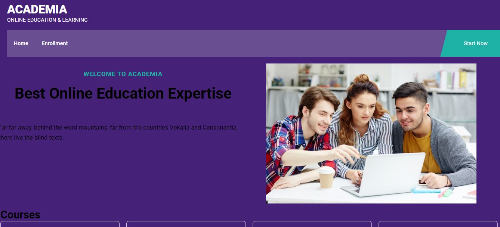

# **Learn Simply** #
EducationApp is a simple web application built using React and Redux that helps users to learn various technology courses. This application provides an interactive interface where users can access different technology materials and resources.

## Images ##

## Features 
- Browse educational topics: Users can explore various topics and subjects.
- View educational content: Users can view detail about courses.
- Users can enroll their courses also.

## Technologies Used 
- React: JavaScript library for building user interfaces.
- Redux: State management library for managing application state.
- React Router: Declarative routing for React applications.
- Firebase: For database.

## Getting Started ##
To get started with the Learn Simply App, follow the steps below:
1. Clone the repository:
git clone repository-url

2. Install the dependencies:
cd my-app
npm install

3. Run the development server:
npm start
Open your browser and navigate to http://localhost:3000 to access the application.

